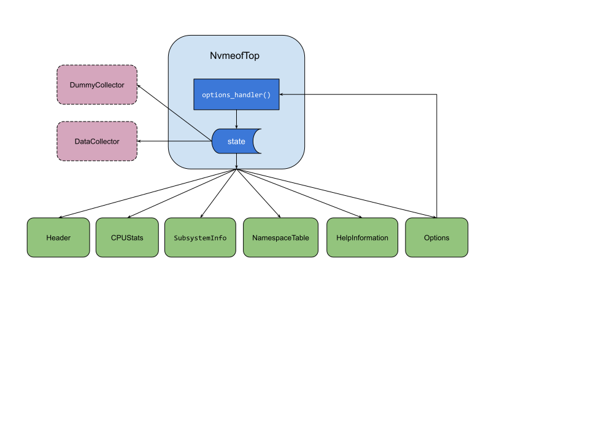

# Design Overview
As an aide-memoire here's some notes that describe the overall design principles for the nvmeof-top tool.

- Use a UX scheme that is familiar to users of `top` and `iostat`
- Use an object hierarchy to link the various components together
- A single parent object owns application state (app.py/NVMeoFTop) and instantiates all UI component objects.
- Every UI component is implemented as a different class in their own python module
- A common module provides the color palette and UI base classes used by the main UI components
- Each UI component is instantiated with a reference to the parent object, allowing the child component to 'react' to state changes like sort sequence etc
- The UI components handle formatting and layout of the data
- The options component is the only component that uses a callback handler
- Changes to application state are done in the parent object handler method i.e. child components may read state but don't change it - this is the way :smile: 
- The collector module provides a base Collector class, and implements a DummyCollector class for demo mode and a  DataCollector class for normal running
- Only one collector is active
- The collector is responsible for fetching the data and handling any required calculations
- when a UI component needs data, it accesses the data by referencing the parent e.g. parent.collector.*
- The collector uses async techniques to parallelize the data gathering
- No 3rd party urwid extensions are used

Here's a diagram;

